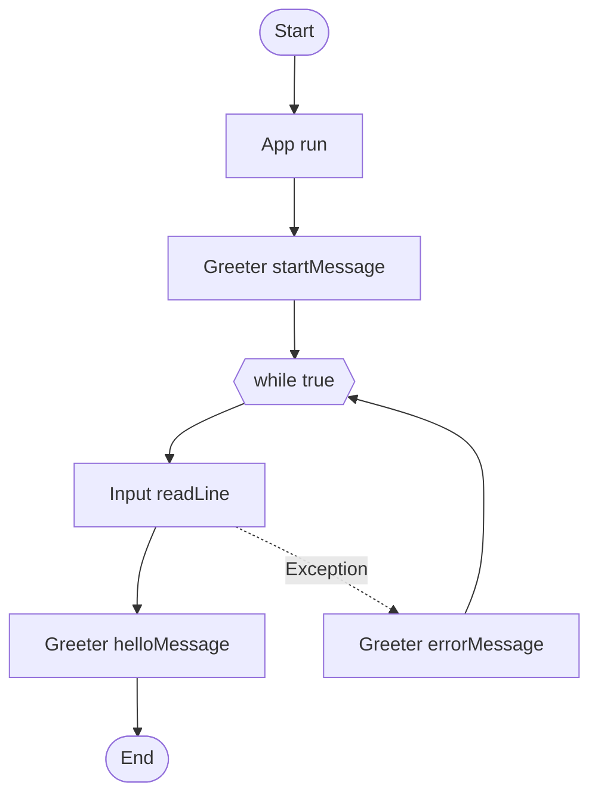

```mermaid
flowchart TD
  S([Start]) --> A[App run]
  A --> B[Greeter startMessage]
  B --> C{{while true}}

  C --> D[Input readLine]
  D --> E[Greeter helloMessage]
  E --> F([End])

  D -. Exception .-> G[Greeter errorMessage]
  G --> C
```